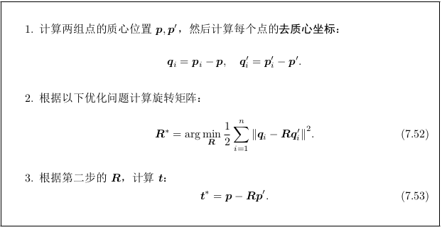
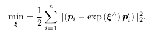
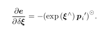
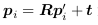
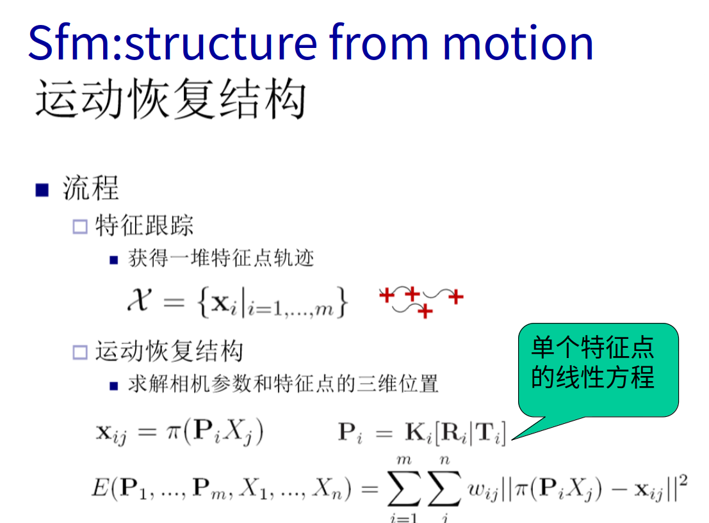

# 智能机器人实验三

SA18225293 彭辰铭

### 1.g2o安装依赖如下

github官方文档显示的需要如下


鉴于之前已经安装了cmake和Eigen3可以知道需要的依赖项有libeigen3-dev、libsuitesparse-dev、qtdeclarative5-dev、qt5-qmake、libqglviewer-dev

```cmd
sudo apt-get install libeigen3-dev libsuitesparse-dev qtdeclarative5-dev qt5-qmake libqglviewer-dev
```

然后依次执行

```cmd
git clone https://github.com/RainerKuemmerle/g2o.git
mkdir build
cd build
cmake ../
make
sudo make install
```

### 2.下载实验代码，并进入代码目录，重新编译


```cmd
cd ~/share/slambook/ch7
cmake .
make
```

运行编译得到的可执行程序

```cmd
pcm@pcm-Inspiron-7447:~/桌面/HomeworkOfUSTC/智能机器人/Lab3/ch7$ ./feature_extraction 1.png 2.png
[ INFO:0] Initialize OpenCL runtime...
Gtk-Message: 00:45:13.813: Failed to load module "canberra-gtk-module"
-- Max dist : 95.000000 
-- Min dist : 7.000000 
```

结果如图所示


### 3.自己拍照得到的结果为


### 4.ICP法相机姿态估计

运行编译后得到的文件为


### 5.g2o图形优化算法库

g2o是一个算法集的C++实现，而并不是在算法理论上的创新，即根据前人求解非线性最小二乘的理论，根据具体的问题，选用最合适的算法。

### 6.ORB特征点提取

1）FAST角点提取

2）给FAST角点添加尺度不变性

3）给FAST角点添加旋转不变性

4）描述子的建立

### 7.ICP法相机位姿估计

#### 迭代最近点(Iterative Closest Point, ICP)求解。

ICP 的求解也分为两种方式:利用线性代数的求解(主要是 SVD),以及利用非线性优化方式的求解(类似于 Bundle Adjustment)

#### SVD步骤：



#### 非线性优化方法：

以迭代的方式去找最优值。

以李代数表达位姿时,目标函数可以写成:



单个误差项关于位姿导数已经在前面推导过了,使用李代数扰动模型即可:



ICP问题存在唯一解或无穷多解的情况。在唯一解的情况下,只要我们能找到极小值解,那么这个极小值就是全局最优值——因此不会遇到局部极小而非全局最小的情况。这也意味着ICP 求解可以任意选定初始值。这是已经匹配点时求解 ICP 的一大好处。

#### 在示例代码中

SVD方法中调用Eigen进行SVD，然后计算SVD，计算R，t矩阵。输出匹配后的结果。需要注意的是，由于前面的推倒按照



进行的，这里的R，t是第二帧到第一帧的变换，与之前的PnP相反。所以输出结果中打印了逆变换。




