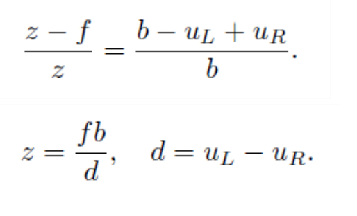

# 智能机器人第二次实验

SA18225293 彭辰铭

### 1.安装OpenCv3

由于第一次实验我已经是使用的OpenCv3，所以这里不再重复安装

### 2.安装点云工具PCL

使用老师提供的第一个安装指令时遇到了

```cmd
This only exists for history reasons. Please use the PCL version included in Ubuntu:

sudo apt install libpcl-dev

---


The Point Cloud Library (or PCL) is a large scale, open project for point cloud processing.
The PCL framework contains numerous state-of-the art algorithms including filtering, feature estimation, surface reconstruction, registration, model fitting and segmentation.
PCL is released under the terms of the BSD license and is open source software. It is free for commercial and research use. We are financially supported by Willow Garage, NVidia, and Google.
 更多信息： https://launchpad.net/~v-launchpad-jochen-sprickerhof-de/+archive/ubuntu/pcl

```

然后使用了

```cmd
sudo apt install libpcl-dev
```

此时就已经能够跑通示例代码了

但是需要安装pcdviewer工具来查看结果

```cmd
apt install pcl-tools
//然后可以使用pcl_viewer 来查看结果
pcl_viewer xxx.pcd
```

### 3.熟悉线性代数运算库Eigen

这里在作业二中有提及到，可以参考第二次作业中的代码以及注释。

```c++
 Eigen::Matrix3d rotation_matrix = Eigen::Matrix3d::Identity(); //单位矩阵
    // 旋转向量使用 AngleAxis, 它底层不直接是Matrix，但运算可以当作矩阵（因为重载了运算符）
    Eigen::AngleAxisd rotation_vector ( M_PI/4, Eigen::Vector3d ( 0,0,1 ) );     //沿 Z 轴旋转 45 度
 rotation_matrix = rotation_vector.toRotationMatrix();
    // 用 AngleAxis 可以进行坐标变换
    Eigen::Vector3d v ( 1,0,0 );
    Eigen::Vector3d v_rotated = rotation_vector * v;
	 Eigen::Vector3d euler_angles = rotation_matrix.eulerAngles ( 2,1,0 ); // ZYX顺序，即roll pitch yaw顺序
    //即 翻滚角，俯仰角，偏航角
	Eigen::Isometry3d T=Eigen::Isometry3d::Identity();                // 虽然称为3d，实质上是4＊4的矩阵
    T.rotate ( rotation_vector );                                     // 按照rotation_vector进行旋转
    T.pretranslate ( Eigen::Vector3d ( 1,3,4 ) );                     // 把平移向量设成(1,3,4)

    // 对于仿射和射影变换，使用 Eigen::Affine3d 和 Eigen::Projective3d 即可，略

    // 四元数
    // 可以直接把AngleAxis赋值给四元数，反之亦然
    Eigen::Quaterniond q = Eigen::Quaterniond ( rotation_vector );
    cout<<"quaternion = \n"<<q.coeffs() <<endl;   // 请注意coeffs的顺序是(x,y,z,w),w为实部，前三者为虚部
    // 也可以把旋转矩阵赋给它
    q = Eigen::Quaterniond ( rotation_matrix );
    cout<<"quaternion = \n"<<q.coeffs() <<endl;
    // 使用四元数旋转一个向量，使用重载的乘法即可
    v_rotated = q*v; // 注意数学上是qvq^{-1}
    cout<<"(1,0,0) after rotation = "<<v_rotated.transpose()<<endl;
```


### 4.实现点云图像拼接

进入实验代码所在的文件夹

```cmd
cmake .
make
./joinMap
pcl_viewer map.pcd
```

结果为


### 5.代码分析

```c++
#include <iostream>
#include <fstream>
using namespace std;
#include <opencv2/core/core.hpp>
#include <opencv2/highgui/highgui.hpp>
#include <Eigen/Geometry> 
#include <boost/format.hpp>  // for formating strings
#include <pcl/point_types.h> 
#include <pcl/io/pcd_io.h> 
#include <pcl/visualization/pcl_visualizer.h>

int main( int argc, char** argv )
{
    vector<cv::Mat> colorImgs, depthImgs;    // 彩色图和深度图
    vector<Eigen::Isometry3d, Eigen::aligned_allocator<Eigen::Isometry3d>> poses;         // 用来记录相机位姿信息
    
    ifstream fin("./pose.txt");
    if (!fin)
    {
        cerr<<"请在有pose.txt的目录下运行此程序"<<endl;
        return 1;
    }
    
    for ( int i=0; i<5; i++ )
    {
        boost::format fmt( "./%s/%d.%s" ); //图像文件格式
        colorImgs.push_back( cv::imread( (fmt%"color"%(i+1)%"png").str() ));
        depthImgs.push_back( cv::imread( (fmt%"depth"%(i+1)%"pgm").str(), -1 )); // 使用-1读取原始图像
        
        double data[7] = {0};
        for ( auto& d:data )
            fin>>d;
        //pose.txt中前三个是相对世界坐标系的偏移量，后四个数据是相机的位资信息
        Eigen::Quaterniond q( data[6], data[3], data[4], data[5] );
        Eigen::Isometry3d T(q);
        //获得最终的变化矩阵
        T.pretranslate( Eigen::Vector3d( data[0], data[1], data[2] ));
        poses.push_back( T );
    }
    
    // 计算点云并拼接
    // 相机内参 
    double cx = 325.5;
    double cy = 253.5;
    double fx = 518.0;
    double fy = 519.0;
    double depthScale = 1000.0;
    
    cout<<"正在将图像转换为点云..."<<endl;
    
    // 定义点云使用的格式：这里用的是XYZRGB
    typedef pcl::PointXYZRGB PointT; 
    typedef pcl::PointCloud<PointT> PointCloud;
    
    // 新建一个点云
    PointCloud::Ptr pointCloud( new PointCloud ); 
    for ( int i=0; i<5; i++ )
    {
        cout<<"转换图像中: "<<i+1<<endl; 
        cv::Mat color = colorImgs[i]; 
        cv::Mat depth = depthImgs[i];
        Eigen::Isometry3d T = poses[i];
        for ( int v=0; v<color.rows; v++ )
            for ( int u=0; u<color.cols; u++ )
            {
                unsigned int d = depth.ptr<unsigned short> ( v )[u]; // 深度值
                if ( d==0 ) continue; // 为0表示没有测量到
                //根据投影过程为世界坐标->相机坐标->归一化平面坐标(z=1)->象素坐标
                //我们从像素坐标逐步回推出世界坐标
                Eigen::Vector3d point; 
                //根据象素坐标计算相机坐标
                point[2] = double(d)/depthScale; 
                point[0] = (u-cx)*point[2]/fx;
                point[1] = (v-cy)*point[2]/fy; 
                //相机坐标根据转换矩阵得到世界坐标
                Eigen::Vector3d pointWorld = T*point;
                
                PointT p ;
                p.x = pointWorld[0];
                p.y = pointWorld[1];
                p.z = pointWorld[2];
                p.b = color.data[ v*color.step+u*color.channels() ];
                p.g = color.data[ v*color.step+u*color.channels()+1 ];
                p.r = color.data[ v*color.step+u*color.channels()+2 ];
                pointCloud->points.push_back( p );
                //将该点放入点云对象中
            }
    }
    
    pointCloud->is_dense = false;
    cout<<"点云共有"<<pointCloud->size()<<"个点."<<endl;
    //将数据保存为点云的pcd格式文件
    pcl::io::savePCDFileBinary("map.pcd", *pointCloud );
    return 0;
}
```


### 6.双目视觉系统标定与深度测量

原理分析


