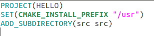
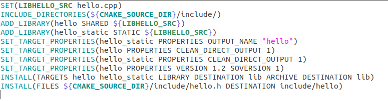
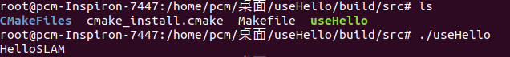
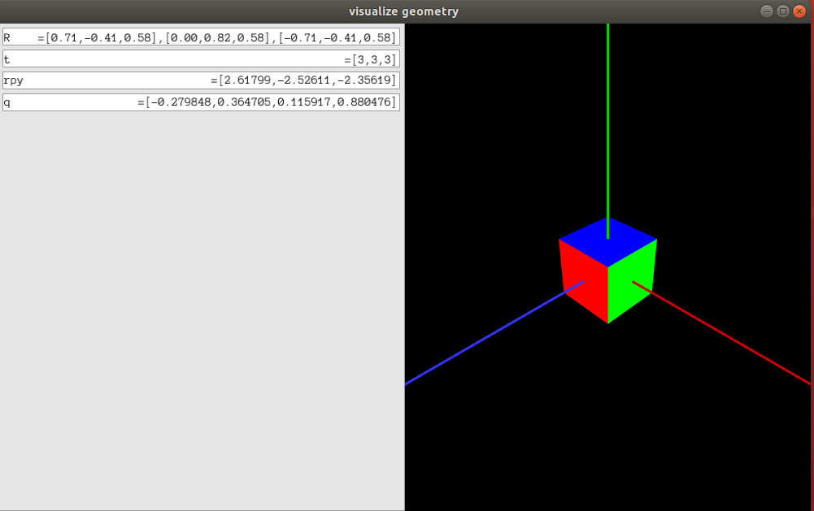
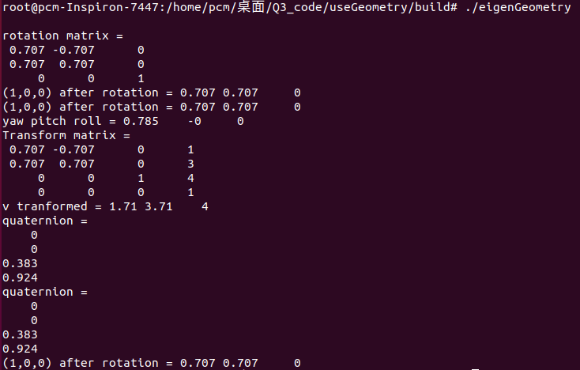

# 智能机器人第二次作业

#### 彭辰铭 SA18225293

## 1.首先在homework_1文件夹中我创建了include，src文件夹，其中各放入hello.h 与hello.cpp文件

## 2.编写CMakeLists.txt

### 编写主文件夹下的CMakeLists.txt



### 编写src文件夹下的CMakeLists.txt



## 3.编译、安装

### 创建build文件夹，并进入

外部编译的方式,输入

```cmd
cmake ..
make
make install
```

结果为

```cmd
-- The C compiler identification is GNU 7.3.0
-- The CXX compiler identification is GNU 7.3.0
-- Check for working C compiler: /usr/bin/cc
-- Check for working C compiler: /usr/bin/cc -- works
-- Detecting C compiler ABI info
-- Detecting C compiler ABI info - done
-- Detecting C compile features
-- Detecting C compile features - done
-- Check for working CXX compiler: /usr/bin/c++
-- Check for working CXX compiler: /usr/bin/c++ -- works
-- Detecting CXX compiler ABI info
-- Detecting CXX compiler ABI info - done
-- Detecting CXX compile features
-- Detecting CXX compile features - done
CMake Warning (dev) in CMakeLists.txt:
  No cmake_minimum_required command is present.  A line of code such as

    cmake_minimum_required(VERSION 3.10)

  should be added at the top of the file.  The version specified may be lower
  if you wish to support older CMake versions for this project.  For more
  information run "cmake --help-policy CMP0000".
This warning is for project developers.  Use -Wno-dev to suppress it.

-- Configuring done
-- Generating done
-- Build files have been written to: /home/pcm/桌面/homework_1/build

```

```cmd
Scanning dependencies of target hello_static
[ 25%] Building CXX object src/CMakeFiles/hello_static.dir/hello.o
[ 50%] Linking CXX static library libhello.a
[ 50%] Built target hello_static
Scanning dependencies of target hello
[ 75%] Building CXX object src/CMakeFiles/hello.dir/hello.o
[100%] Linking CXX shared library libhello.so
[100%] Built target hello

```

```cmd
[ 50%] Built target hello_static
[100%] Built target hello
Install the project...
-- Install configuration: ""
-- Installing: /usr/lib/libhello.so.1.2
-- Up-to-date: /usr/lib/libhello.so.1
-- Up-to-date: /usr/lib/libhello.so
-- Installing: /usr/lib/libhello.a
-- Installing: /usr/include/hello/hello.h

```

## 4.编译useHello.cpp文件并进行测试

创建一个useHello文件夹，其中创建src文件夹，并在其中放入useHello.cpp

主文件夹下编写CMakeLists.txt文件

```cmake
PROJECT(NEWHELLO)
ADD_SUBDIRECTORY(src)
```

src 文件夹下编写CMakeLists.txt文件

```cmake
ADD_EXECUTABLE(useHello useHello.cpp)
INCLUDE_DIRECTORIES(/usr/include/hello)
TARGET_LINK_LIBRARIES(useHello libhello.so)
```

(这里可以通过设置)

```cmd
export CMAKE_INCLUDE_PATH=/usr/include/hello
```

然后在CMakeLists.txt文件中将INCLUDE_DIRECTORIES替换为

```cmake
FIND_PATH(myHeader hello.h)
IF(myHeader)
INCLUDE_DIRECTORIES(${myHeader})
ENDIF(myHeader)
```

然后在主文件夹中创建build文件夹，并进入其中

使用

```cmd
cmake
make
cd src
./useHello
```

得到结果为




按照教程安装好Pangolin

运行结果为：



以及



### 代码分析

eigenGeometry.cpp

```c++
#include <iostream>
#include <cmath>
using namespace std;

#include <Eigen/Core>
// Eigen 几何模块
#include <Eigen/Geometry>

/****************************
* 本程序演示了 Eigen 几何模块的使用方法
****************************/

int main ( int argc, char** argv ) //表示运行时输的参数的个数与字符型数组
{
    // Eigen/Geometry 模块提供了各种旋转和平移的表示
    // 3D 旋转矩阵直接使用 Matrix3d 或 Matrix3f
    Eigen::Matrix3d rotation_matrix = Eigen::Matrix3d::Identity(); //单位矩阵
    // 旋转向量使用 AngleAxis, 它底层不直接是Matrix，但运算可以当作矩阵（因为重载了运算符）
    Eigen::AngleAxisd rotation_vector ( M_PI/4, Eigen::Vector3d ( 0,0,1 ) );     //沿 Z 轴旋转 45 度
    cout .precision(3);
    cout<<"rotation matrix =\n"<<rotation_vector.matrix() <<endl;                //用matrix()转换成矩阵
    // 也可以直接赋值
    rotation_matrix = rotation_vector.toRotationMatrix();
    // 用 AngleAxis 可以进行坐标变换
    Eigen::Vector3d v ( 1,0,0 );
    Eigen::Vector3d v_rotated = rotation_vector * v;
    cout<<"(1,0,0) after rotation = "<<v_rotated.transpose()<<endl;
    // 或者用旋转矩阵
    v_rotated = rotation_matrix * v;
    cout<<"(1,0,0) after rotation = "<<v_rotated.transpose()<<endl;

    // 欧拉角: 可以将旋转矩阵直接转换成欧拉角
    Eigen::Vector3d euler_angles = rotation_matrix.eulerAngles ( 2,1,0 ); // ZYX顺序，即roll pitch yaw顺序
    //即 翻滚角，俯仰角，偏航角
    cout<<"yaw pitch roll = "<<euler_angles.transpose()<<endl;

    // 欧氏变换矩阵使用 Eigen::Isometry
    Eigen::Isometry3d T=Eigen::Isometry3d::Identity();                // 虽然称为3d，实质上是4＊4的矩阵
    T.rotate ( rotation_vector );                                     // 按照rotation_vector进行旋转
    T.pretranslate ( Eigen::Vector3d ( 1,3,4 ) );                     // 把平移向量设成(1,3,4)
    cout << "Transform matrix = \n" << T.matrix() <<endl;

    // 用变换矩阵进行坐标变换
    Eigen::Vector3d v_transformed = T*v;                              // 相当于R*v+t
    cout<<"v tranformed = "<<v_transformed.transpose()<<endl;

    // 对于仿射和射影变换，使用 Eigen::Affine3d 和 Eigen::Projective3d 即可，略

    // 四元数
    // 可以直接把AngleAxis赋值给四元数，反之亦然
    Eigen::Quaterniond q = Eigen::Quaterniond ( rotation_vector );
    cout<<"quaternion = \n"<<q.coeffs() <<endl;   // 请注意coeffs的顺序是(x,y,z,w),w为实部，前三者为虚部
    // 也可以把旋转矩阵赋给它
    q = Eigen::Quaterniond ( rotation_matrix );
    cout<<"quaternion = \n"<<q.coeffs() <<endl;
    // 使用四元数旋转一个向量，使用重载的乘法即可
    v_rotated = q*v; // 注意数学上是qvq^{-1}
    cout<<"(1,0,0) after rotation = "<<v_rotated.transpose()<<endl;

    return 0;
}

```


visualizeGeometry.cpp

```c++
#include <iostream>
#include <iomanip>
using namespace std;

#include <Eigen/Core>
#include <Eigen/Geometry>
using namespace Eigen;

#include <pangolin/pangolin.h>

struct RotationMatrix
{
    Matrix3d matrix = Matrix3d::Identity();
};

ostream& operator << ( ostream& out, const RotationMatrix& r )  // os流 重载符号 <<
{
    out.setf(ios::fixed);
    Matrix3d matrix = r.matrix;
    out<<'=';
    out<<"["<<setprecision(2)<<matrix(0,0)<<","<<matrix(0,1)<<","<<matrix(0,2)<<"],"
    << "["<<matrix(1,0)<<","<<matrix(1,1)<<","<<matrix(1,2)<<"],"
    << "["<<matrix(2,0)<<","<<matrix(2,1)<<","<<matrix(2,2)<<"]";
    return out;
}

istream& operator >> (istream& in, RotationMatrix& r )      //is流 重载 >>
{
    return in;
}

struct TranslationVector
{
    Vector3d trans = Vector3d(0,0,0);   //赋初值为(0,0,0)
};

ostream& operator << (ostream& out, const TranslationVector& t)  //对于TranlationVector的重载
{
    out<<"=["<<t.trans(0)<<','<<t.trans(1)<<','<<t.trans(2)<<"]";
    return out;
}

istream& operator >> ( istream& in, TranslationVector& t) 
{
    return in;
}

struct QuaternionDraw
{
    Quaterniond q;
};

ostream& operator << (ostream& out, const QuaternionDraw quat ) //对于QuaternionDraw的重载
{
    auto c = quat.q.coeffs();
    out<<"=["<<c[0]<<","<<c[1]<<","<<c[2]<<","<<c[3]<<"]";
    return out;
}

istream& operator >> (istream& in, const QuaternionDraw quat)
{
    return in;
}

int main ( int argc, char** argv )
{
    pangolin::CreateWindowAndBind ( "visualize geometry", 1000, 600 );//创建名字为visualize geometry，大小为1000*600的窗口
    glEnable ( GL_DEPTH_TEST ); //启动深度测试
    pangolin::OpenGlRenderState s_cam (
        pangolin::ProjectionMatrix ( 1000, 600, 420, 420, 500, 300, 0.1, 1000 ),
        //对应的是gluLookAt，摄像机位置，参考点位置，up vector（上向量）
        pangolin::ModelViewLookAt ( 3,3,3,0,0,0,pangolin::AxisY )
    );
    
    const int UI_WIDTH = 500;
    //定义相机对象的参数
    pangolin::View& d_cam = pangolin::CreateDisplay().SetBounds(0.0, 1.0, pangolin::Attach::Pix(UI_WIDTH), 1.0, -1000.0f/600.0f).SetHandler(new pangolin::Handler3D(s_cam));
    
    // ui
    pangolin::Var<RotationMatrix> rotation_matrix("ui.R", RotationMatrix());
    pangolin::Var<TranslationVector> translation_vector("ui.t", TranslationVector());
    pangolin::Var<TranslationVector> euler_angles("ui.rpy", TranslationVector());
    pangolin::Var<QuaternionDraw> quaternion("ui.q", QuaternionDraw());
    pangolin::CreatePanel("ui")
        .SetBounds(0.0, 1.0, 0.0, pangolin::Attach::Pix(UI_WIDTH));
    
    while ( !pangolin::ShouldQuit() )
    {
        glClear( GL_COLOR_BUFFER_BIT | GL_DEPTH_BUFFER_BIT );
        
        d_cam.Activate( s_cam );
        
        pangolin::OpenGlMatrix matrix = s_cam.GetModelViewMatrix();
	pangolin::OpenGlMatrix m = matrix;
        // m = m.inverse();
        RotationMatrix R; 
        for (int i=0; i<3; i++)
            for (int j=0; j<3; j++)
                R.matrix(i,j) = m(j,i);
        rotation_matrix = R;
        
        TranslationVector t;
        t.trans = Vector3d(m(0,3), m(1,3), m(2,3));
        t.trans = -R.matrix*t.trans;
        translation_vector = t;
        
        TranslationVector euler;
        euler.trans = R.matrix.transpose().eulerAngles(2,1,0);
        euler_angles = euler;
        
        QuaternionDraw quat;
        quat.q = Quaterniond(R.matrix);
        quaternion = quat;
        
        glColor3f(1.0,1.0,1.0);
        
        pangolin::glDrawColouredCube();
        // draw the original axis 
        glLineWidth(3);
        glColor3f ( 0.8f,0.f,0.f );
        glBegin ( GL_LINES );
        glVertex3f( 0,0,0 );
        glVertex3f( 10,0,0 );
        glColor3f( 0.f,0.8f,0.f);
        glVertex3f( 0,0,0 );
        glVertex3f( 0,10,0 );
        glColor3f( 0.2f,0.2f,1.f);
        glVertex3f( 0,0,0 );
        glVertex3f( 0,0,10 );
        glEnd();
        
        pangolin::FinishFrame();
    }
}
```


